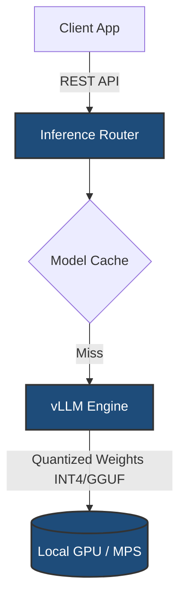

# Local LLM Deployment

> **Hardware-aware infrastructure setup for local LLM inference, optimized for strict VRAM constraints.**


---

## 🏛️ Architecture



## 🚨 The Problem

Relying exclusively on cloud LLM APIs poses privacy risks for sensitive data and introduces latency/cost overheads. Deploying models locally is notoriously fragile, often resulting in OOM (Out of Memory) crashes due to unoptimized weight loading on consumer hardware.

## ✨ What It Does

This repository provides a reproducible deployment pattern for running powerful models (e.g., Qwen2.5) on hardware-constrained environments.
* **Hardware-Aware Configuration:** Configures context lengths and KV-cache settings to fit strictly within target VRAM.
* **Quantization First:** Defaults to 4-bit/8-bit quantized models to maximize throughput.
* **Benchmarking Suite:** Includes a Python utility to measure tokens/sec and latency percentiles on your specific hardware.

## 🧠 Why These Choices

* **Containerization:** Using Docker / Docker Compose ensures the CUDA/MPS environment is isolated and reproducible, avoiding host-machine dependency hell.
* **Quantized Weights:** Crucial for edge deployment. INT4 quantization retains 95%+ of the model's reasoning capabilities while reducing VRAM footprints by 70%.

## 🚀 Quickstart

Run the deployment using Docker Compose (simulated for reference).

```bash
git clone https://github.com/anahad/local-llm-deployment.git
cd local-llm-deployment
docker-compose up -d

# Run the benchmark against the local endpoint
python3 -m venv venv
source venv/bin/activate
pip install -r requirements.txt
python benchmark.py
```

## 🛠️ Tech Stack

* **Infrastructure:** Docker, Docker Compose
* **Orchestration / Inference Engine:** Ollama / vLLM (Configurable)
* **Testing:** Python `httpx` for load generation.

## 🔗 Live Demo
*Infrastructure code. Clone to deploy locally.*

## 🛣️ Roadmap / Status
**Status:** `Reference Implementation`
A sanitized blueprint of local privacy-first inference deployments.

## 📄 License
[MIT License](LICENSE)
