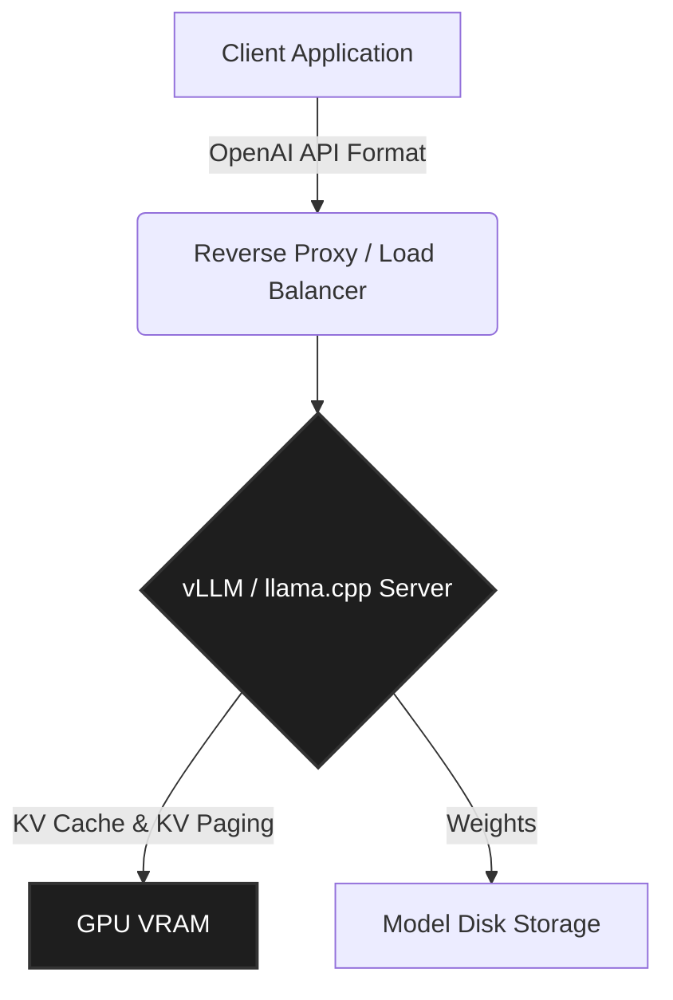

# Local LLM Deployment

> **Hardware-aware inference setup for quantized models with strict VRAM constraints.**


---

## 🚨 The Problem: Cloud Lock-In & Latency
Relying entirely on closed-source cloud providers for LLM inference introduces significant risks: unannounced model deprecation, variable latency, and critical privacy issues when handling PII or proprietary code. Running large models locally is the solution, but managing VRAM constraints and quantization limits is a massive operational headache.

## ✨ The Solution: Optimized Edge Inference
`local-llm-deployment` is a production-grade blueprint for running capable models (like Qwen2.5 or LLaMA 3) on consumer hardware or edge instances. 

### Core Capabilities
* **VRAM Boundary Enforcement:** Configured to strictly limit memory allocation, preventing Out-Of-Memory (OOM) crashes during concurrent batch requests.
* **Quantization Optimization:** Implements INT4/INT8 quantization via GGUF/AWQ formats for maximum throughput with minimal perplexity degradation.
* **Containerized Abstraction:** Exposes an OpenAI-compatible REST API via `vLLM` or `llama.cpp` entirely within Docker, making it a drop-in replacement for any existing cloud API.

---

## 🏛️ Architecture Decision Record (ADR)



### 1. Why vLLM over pure HuggingFace Transformers?
Pure PyTorch/Transformers implementations are incredibly slow for batch inference due to memory fragmentation. We utilize `vLLM` and PagedAttention to actively manage the KV cache, increasing throughput by up to 3x on the same hardware.

### 2. Standardized API Surface
The server runs an OpenAI-compatible wrapper. This allows upstream orchestration systems (like our `scored-diagnostic-engine`) to seamlessly point their `base_url` to `localhost:8000` without changing a single line of SDK code.

---

## 🚀 Quickstart

Run a quantized Qwen2.5 model locally via Docker Compose.

```bash
# 1. Clone the repository
git clone https://github.com/anahad/local-llm-deployment.git
cd local-llm-deployment

# 2. Download the model weights (requires HuggingFace CLI)
./scripts/download_model.sh

# 3. Spin up the inference server
docker-compose up -d

# 4. Test the OpenAI-compatible endpoint
curl http://localhost:8000/v1/chat/completions \
  -H "Content-Type: application/json" \
  -d '{
    "model": "qwen2.5-7b-instruct",
    "messages": [{"role": "user", "content": "Explain KV caching."}]
  }'
```

## 🛣️ Status
**Status:** `Reference Implementation`

This repository is an anonymized, clean-room reference of the self-hosted inference strategy used at **Persona X**. It demonstrates infrastructure range and hardware-awareness.

## 📄 License
[MIT License](LICENSE)
